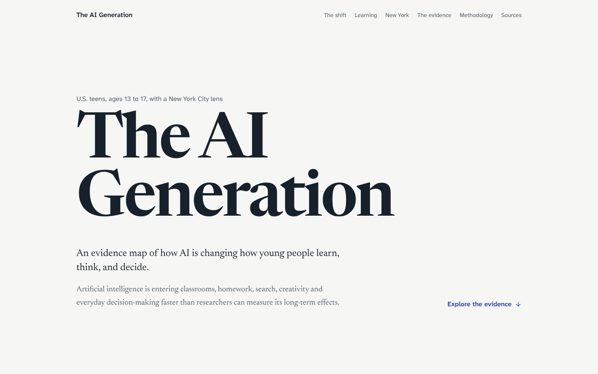
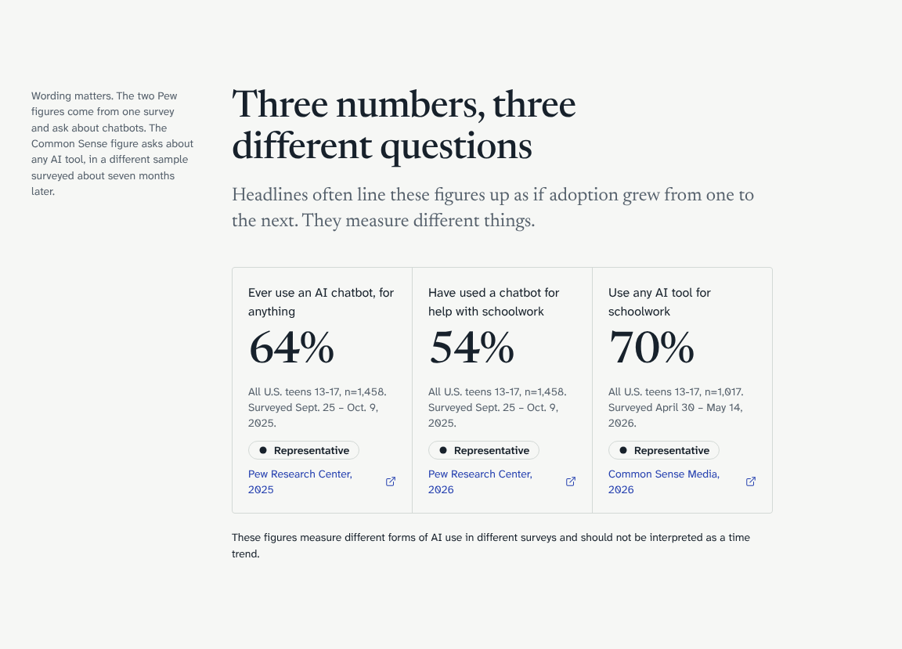
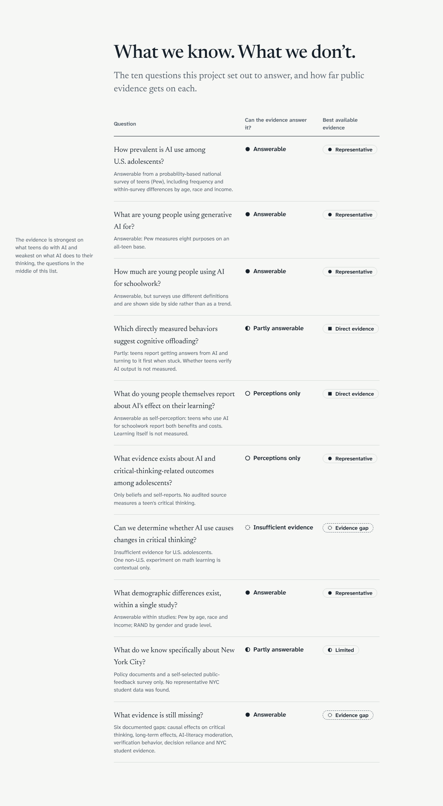

# The AI Generation

**An evidence map of how AI is changing how young people learn, think, and decide, and of what we do not yet know.**

An interactive research story about generative AI and U.S. teens (ages 13–17), with a New York City lens. It is built to answer one question honestly: *is AI changing how teenagers think?* The answer the public evidence supports is that teen AI use is well measured, and its effect on their thinking is not.



## Research question

How is generative AI changing the way young people in the United States learn, think, generate ideas and make decisions, and what do we actually know versus what are we assuming?

The ten research questions, evidence classes and claim rules are defined in [`docs/research-framework.md`](docs/research-framework.md).

## Key findings

All figures are verified against the original reports and stated with who was asked. Full list: [`docs/findings.md`](docs/findings.md).

- **AI use is widespread.** 64% of U.S. teens say they use AI chatbots; 16% use one several times a day or more (Pew, n=1,458, fall 2025).
- **Schoolwork is a main use.** 54% of teens have used chatbots for schoolwork help, and 10% do all or most of their schoolwork with them (Pew). Common Sense Media finds 70% use any AI tool for schoolwork, a different question in a different survey, not a trend.
- **Teens report both help and offloading.** Among teens who use AI for schoolwork (n=665), 63% get answers from AI and 77% use it without getting answers; 66% say it helps them understand their work, while 39% feel they miss out on learning and 38% say they come up with fewer of their own ideas.
- **Students believe AI harms critical thinking.** 67% of enrolled students ages 12–29 agree (RAND). This is a belief, not a measurement.
- **NYC has policy and public feedback, not student data.** 65.2% of respondents to the NYCPS public-feedback survey (6,491 self-selected responses) named cognitive development as a top concern.
- **The central finding is a gap.** No public source measures a U.S. teen’s critical thinking alongside their AI use or tests causation. On “does AI reduce critical thinking?”: **insufficient evidence**.

## What makes this different



- **Every number carries its denominator and source.** A figure can only be rendered from a verified evidence point; unverified figures render as “Awaiting verification”.
- **No invented relationships.** No correlations, regressions, merged datasets or composite indices. The public evidence is aggregate only, so the site reports each study’s own figures and shows where they stop.
- **Evidence classes, not scores.** Direct evidence, Representative, Contextual, Limited and Evidence gap are shown as categorical chips with distinct shapes, never as bar lengths.
- **Gaps are shown on purpose.** The evidence map and evidence chain show exactly where the evidence runs out.



## Evidence limitations

Causal conclusions cannot currently be drawn because all teen evidence is self-reported, cross-sectional and aggregate; no source measures critical thinking directly; and the one randomized experiment found is from a single Turkish school and measures math learning. See [`docs/limitations-and-gaps.md`](docs/limitations-and-gaps.md).

## Data sources

| Source | Population | n | Class |
|---|---|--:|---|
| Pew Research Center, *Teens, Social Media and AI Chatbots 2025* and *How Teens Use and View AI* (2025–26) | U.S. teens 13–17 | 1,458 | Representative |
| Common Sense Media / NORC, *Teens in the AI Era: Schoolwork and Skills That Matter* (2026) | U.S. teens 13–17 | 1,017 | Direct / Representative |
| RAND, *More Students Use AI for Homework, and More Believe It Harms Critical Thinking* (2026) | Enrolled U.S. students 12–29 | 1,214 | Representative |
| NYC Public Schools, *AI Public Feedback Survey* (2026) | Self-selected respondents | 6,491 | Limited |
| NYC Public Schools AI policy timeline (2026) | Policy records | — | Contextual |
| Bastani et al., *Generative AI without guardrails can harm learning*, PNAS (2025) | High school students, one school in Turkey | ~1,000 | Contextual |

Full registry with methods, variables and limitations: [`data/source-registry.json`](data/source-registry.json). Source audit: [`RESEARCH_AUDIT.md`](RESEARCH_AUDIT.md).

## Methodology

1. **Source audit.** Primary sources were checked for population, sample, method, variables, microdata availability and limitations.
2. **Evidence entry.** 85 evidence points in [`research/evidence.jsonl`](research/evidence.jsonl), each with exact question wording, respondent base, evidence class and verification status ([notes](docs/evidence-notes.md)).
3. **Validation.** [`research/build_evidence.py`](research/build_evidence.py) rejects missing citations or methodology, duplicate ids, out-of-range percentages and bases larger than the sample, then writes `data/evidence.json`.
4. **Display rules.** Only verified points render. Charts refuse to mix respondent bases. Surveys are never connected as trends.

## Research integrity

> This project does not combine incompatible aggregate statistics into synthetic datasets or indices.

It also never presents beliefs as measurements, national figures as NYC figures, NYC feedback respondents as NYC students, or a non-U.S. experiment as evidence about U.S. teens’ critical thinking.

## Architecture

```text
research/evidence.jsonl ──► research/build_evidence.py ──► data/evidence.json ──► Next.js (static)
data/source-registry.json ─┘   (validate + join sources)                          lib/evidence.ts
data/research-questions.json ─────────────────────────────────────────────────────► lib/research-questions.ts
```

- **Frontend:** Next.js 16 (App Router, statically prerendered), React 19, TypeScript, Tailwind CSS v4, D3 (scales), Framer Motion (one count-up, respects reduced motion), Lucide icons.
- **Integrity in code:** `Statistic` accepts only evidence points; `resolveVisualization` fails the build on mixed bases or unknown ids; `canDisplay` gates unverified data; registry and research questions are validated at build time.
- **Accessibility:** semantic sections, skip link, keyboard-operable charts, per-bar tooltips on hover and focus, a table view for every chart, reduced-motion support, light and dark themes.

```text
app/                    page, layout, bundled fonts (OFL)
components/
  sections/             story chapters (Hero, Adoption, LearningAndThinking, NewYork, EvidenceGap, Methodology, Sources)
  visualizations/       BarList, SeparateMeasures, EvidenceChain, EvidenceMap, ProposedSpectrum, SourceExplorer, CountUp
  evidence/             EvidenceChip, EvidenceLegend, EvidenceDetail, EvidenceNote, Statistic, SourceAttribution
  ui/                   Section, SectionHeader, SiteHeader, DataPending, MotionProvider
data/                   source registry, research questions, generated evidence
docs/                   framework, evidence notes, findings, limitations and gaps
lib/                    types, evidence access, classes, formatting
research/               evidence rows, validation pipeline and tests
styles/                 design tokens
```

## Run locally

Requires Node 20.9+ (developed on Node 22). Python 3 is needed only to rebuild the evidence data.

```bash
npm install
npm run dev          # http://localhost:3000
npm run lint
npm run typecheck
npm run build

npm run data:build   # validate research/evidence.jsonl and regenerate data/evidence.json
npm run data:test    # validator tests
```

On systems where Python is called `python3`, run `python3 research/build_evidence.py` directly.

## Future research

Answering whether AI changes how teens think needs respondent-level, longitudinal data that measures AI exposure, cognitive behavior, learning and decision-making in the same teens, collected with parental consent, teen assent and ethics review. The proposed measurement framework is on the site and in [`docs/limitations-and-gaps.md`](docs/limitations-and-gaps.md).

## License

Code and original writing: MIT (see [`LICENSE`](LICENSE)). Survey figures belong to their publishers and are reproduced with attribution. Fonts: SIL Open Font License 1.1.
